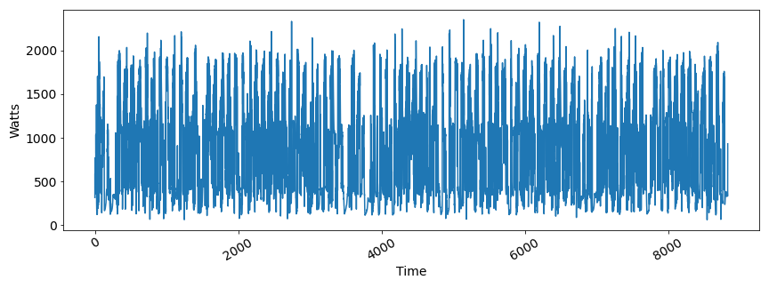
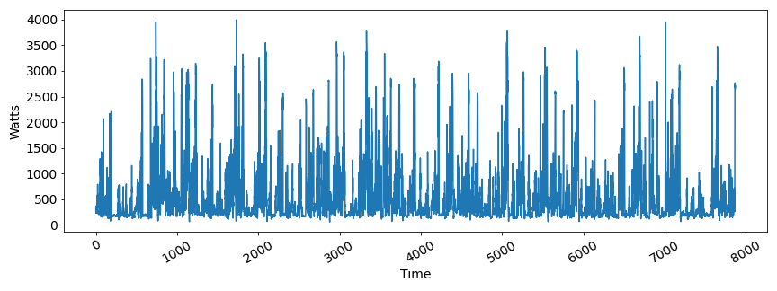
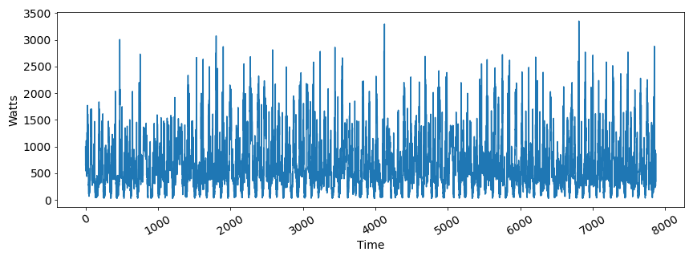

# Augmented-Smart-dataset

This repository is a part of the paper titled *Forecasting Energy Power Consumption using
Federated Learning in Edge Computing Devices*, in which we evaluated the federated learning procedure for training machine learning algorithms to forecast consumers' energy power consumption. For this study, we used a modified version of the Smart* dataset[1] and the Building Data Genome Project 2 dataset[2]. In the case of the Smart* dataset, we computed the average of the measurements for three houses (A, B, C) in a time window of 15 minutes.

As a contribution, we also made available a augmented version of the Smart* dataset in this repository. This version contains seven new houses (D, E, F, G, H, I, J) and is generated from the three original houses as such: D, E, and F (from House A), G and H (from House B), and I and J (from House C). 

The generation process consists of training a Deep Generative Model, based on Generative Adversarial Networks (GANs)[3], known as TimeGAN[4], for a given number of steps and evaluating how the generated data compare to the original ones. For example, it is desirable that the synthetic data have the main characteristics (e.g., trends and seasonality) of the real data, such as possible peak hours or times with less use. However, to guarantee the necessary variability to evaluate the generalization of the models, it is also desirable that the synthetic and real data are somewhat distinct. It is important to point out that, when evaluating GANs, measuring the similarity between synthetic and real data is still an open problem ([5],[6]), especially when dealing with time series[7]. When possible, a commonly used method of evaluation is to visually compare the similarity between synthetic and real data.

# Datasets Sample (House D)

| **TimestampUTC**    | **Watts** |
|---------------------|-----------|
| 2012-04-30 09:15:00 | 317.61853 |
| 2012-04-30 09:30:00 | 595.5591  |
| 2012-04-30 09:45:00 | 358.95502 |

## Datasets plots

**House E**

**House G**

**House I**

# References:

    [1] - S. Barker, A. Mishra, D. Irwin, E. Cecchet, P. Shenoy, J. Albrecht, Smart*: An open data set and tools for enabling research in sustainable homes, Proc. SustKDD. (01 2012).

    [2] - C. Miller, A. Kathirgamanathan, B. Picchetti, P. Arjunan, J. Y. Park, Z. Nagy, P. Raftery, B. W. Hobson, Z. Shi, F. Meggers, The building data genome project 2, energy meter data from the ASHRAE great energy predictor III competition, Scientific Data 7 (2020) 368.

    [3] - I. Goodfellow, J. Pouget-Abadie, M. Mirza, B. Xu, D. Warde-Farley, S. Ozair, A. Courville, Y. Bengio, Generative adversarial nets, in: Advances in neural information processing systems, 2014, pp. 2672–2680.

    [4] - J. Yoon, D. Jarrett, M. Van der Schaar, Time-series generative adversarial networks, Advances in neural information processing systems 32 (2019).

    [5] - M. Lucic, K. Kurach, M. Michalski, S. Gelly, O. Bousquet, Are gans created equal? a large-scale study, Advances in neural information processing systems 31 (2018)

    [6] - A. Borji, Pros and cons of gan evaluation measures, Computer Vision and Image Understanding 179 (2019) 41–65.

    [7] - D. Zhang, M. Ma, L. Xia, A comprehensive review on gans for time-series signals, Neural Computing and Applications 34 (5) (2022) 3551–3571   